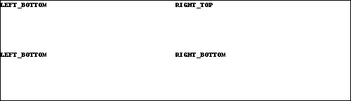

# E-Paper-UI-Kit


UIKit for Raspberry on E-Paper

## Usage
```
# -*- coding:utf-8 -*-
from PIL import ImageFont
from EPUIKit import QuadrantsLayout, VirtualPaper
from EPUIKit.widget import Label


layout = QuadrantsLayout(border=1)
layout.add(Label('LEFT_BOTTOM', font=ImageFont.load_default()), QuadrantsLayout.LEFT_TOP)
layout.add(Label('LEFT_BOTTOM', font=ImageFont.load_default()), QuadrantsLayout.LEFT_BOTTOM)
layout.add(Label('RIGHT_TOP', font=ImageFont.load_default()), QuadrantsLayout.RIGHT_TOP)
layout.add(Label('RIGHT_BOTTOM', font=ImageFont.load_default()), QuadrantsLayout.RIGHT_BOTTOM)
paper = VirtualPaper(layout, 144, 500)
paper.show()
```



## Supported devices

* waveshare 1.54inch e-Paper HAT V2
* waveshare 2.13inch e-Paper HAT V2

## License

MIT
